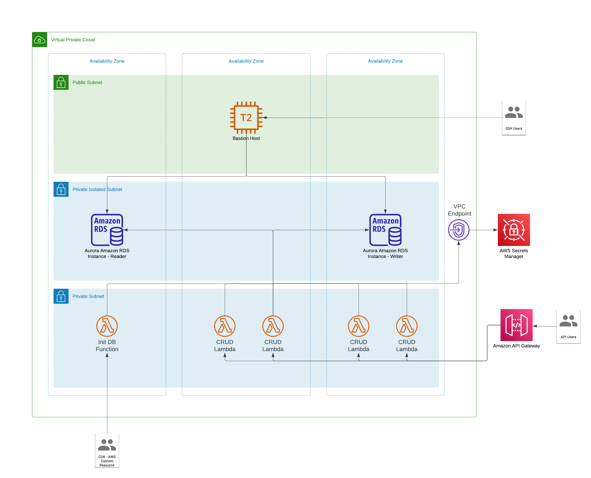

# CDK Example Consuming and Building Custom Constructs

This is an example CDK app for the purposes of demonstrating how to write, consume, and deploy custom constructs.
Additionally, this example is to highlight the power of the abstractions provided by the CDK, allowing us to deploy 
complex architecture with minimal effort in our infrastructure stacks.

## Architecture

This CDK application creates a custom L3 construct called AuroraMysqlWithBastionHost. This construct creates the following:

- VPC with public, private and isolated subnets
- RDS Aurara MySQL cluster
- Bastion host in the public subnet so that we can connect from our local machine to the RDS cluster
- Keypair to be used for SSH access to the bastion host (this uses an L3 construct from npm package cdk-ec2-key-pair)
- Network resources and configuration to allow the bastion host to connect to the RDS cluster and a VPC endpoint 
  to allow our lambdas to get secrets from Secrets Manager

The DataStack class deploys a cloudformation stack which deploys the AuroraMysqlWithBastionHost construct as well as a
MysqlSetup custom construct that leverages lambda and custom resources to create a table and populate it with data in
our RDS cluster.



## Prerequisites

- aws-cli installed and configured with credentials for your account
- nodejs installed
- npm installed
- aws-cdk installed
- env vars set for your AWS account and region

```bash
export AWS_REGION=us-east-2 # use your preferred region here
export AWS_ACCOUNT=111111111111 # use your AWS account number here
```

## Deploying

```
npm install
npm run build # important: this will build our lambda code assets
cdk synth # not required but it will output the CloudFormation template you're about to deploy
cdk deploy --all # this will synthesize and deploy our stacks as well as bundle up our lambda code assets
```
You should see multiple outputs from this deploytment. These will be used in the commands below:

Outputs include:
- VPC/Subnet Deetails
- Bastion Host IP
- Key Pair Private Key Secret ID (Arn)
- RDS Cluster Endpoint
- RDS Secret ID (Arn)
- API Gateway URL

## Interact with the RDS Cluster

### CRUD APIs
```bash
// Get an existing record
curl -X GET <API Gateway URL output>/name/1

// Create a new record
curl -X POST <API Gateway URL output>/name/99 \
     -H "Content-Type: application/json" \
     -d '{"name": "Olly"}'
// Retrieve the new record
curl -X GET <API Gateway URL output>/name/99

//Update the record
curl -X PUT <API Gateway URL output>/name/99
     -H "Content-Type: application/json" 
     -d '{"name": "Olly Lastname"}'
     
// Verify the update
curl -X GET <API Gateway URL output>/name/99

// Delete the record
curl -X DELETE <API Gateway URL output>/name/99

// Verify the delete
curl -X GET <API Gateway URL output>/name/99    
```

### Bastion Host
```bash
# Get your private key
aws secretsmanager get-secret-value \
  --secret-id <private key ARN output> \
  --query SecretString \
  --output text > rds-bastion-host-key-pair.pem
  
# Set permissions on file
chmod 400 rds-bastion-host-key-pair.pem

# Get your mysql password and default DB name
aws secretsmanager get-secret-value \
  --secret-id <database clsuter secret output> \
  --query SecretString \
  --output text
  
# Connect to bastion host
ssh -i rds-bastion-host-key-pair.pem ec2-user@<bastion host IP output>

# Connect to mysql server - password and cluster id are available in AWS Secrets Manager
mysql -h <cluster endpoint output> -D mydb -u dbadmin -p

# If mysql is not found issue the following command on your ec2 instance (TODO need to fix init script)
sudo yum install mysql

# Run some queries
mysql> show databases;
mysql> use mydb;
mysql> show tables;
mysql> select * from mytable;
```

## Disclaimer
This application deploys some non-free tier resources. You will potentially be charged for the resources created by this 
application. Ensure you destroy the resources when you're done.

## Cleanup
`cdk destroy # you will be prompted to confirm the deletion of the stacks`

## What's Next

- leverage the NodejsFunction construct to deploy our lambda code
  - would easily solve the issue of us bundling all lambdas in our asset and instead deploy them individually
- recreate this example with CDK for Terraform (CDKtf)